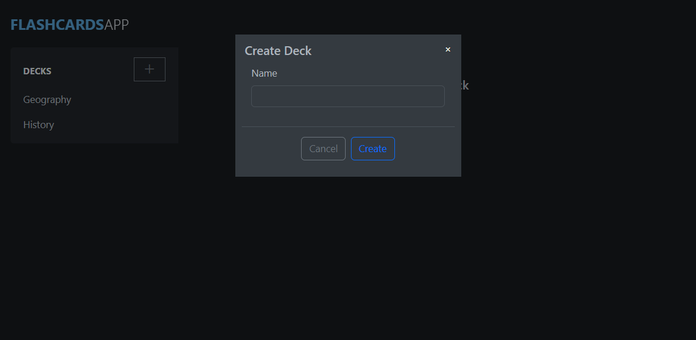
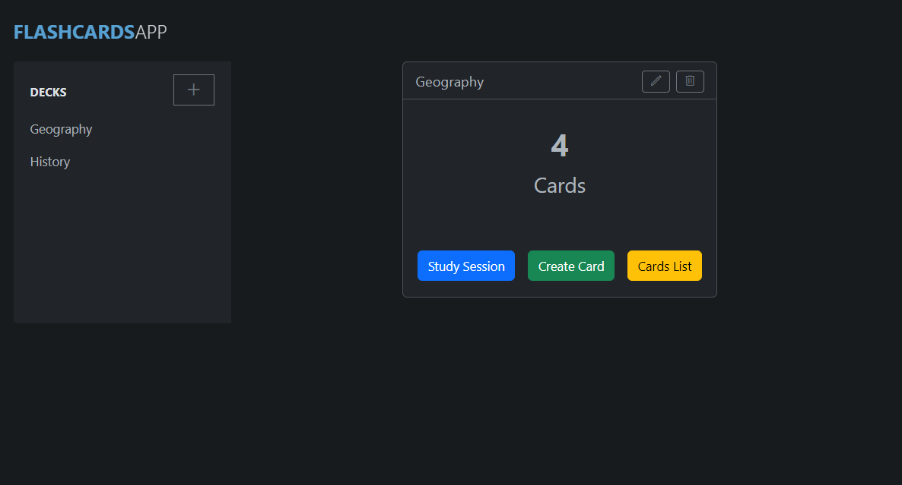
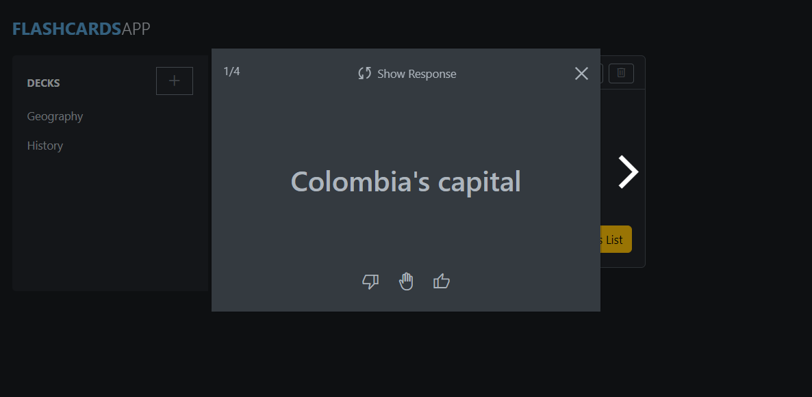
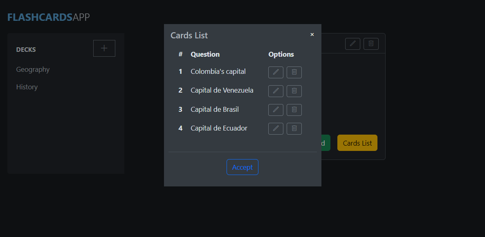

[Backend] (https://github.com/0yapunpun/flashcards_back)

## Setup
To run this project: 

1. Clone the repo
   ```sh
   git clone https://github.com/0yapunpun/flashcards_react.git
   ```
2. Install NPM packages
   ```sh
   npm install
   ```
3. Init the project
   ```sh
   npm start
   ```
   
## Built with 
- React
- Bootstrap


## Site









